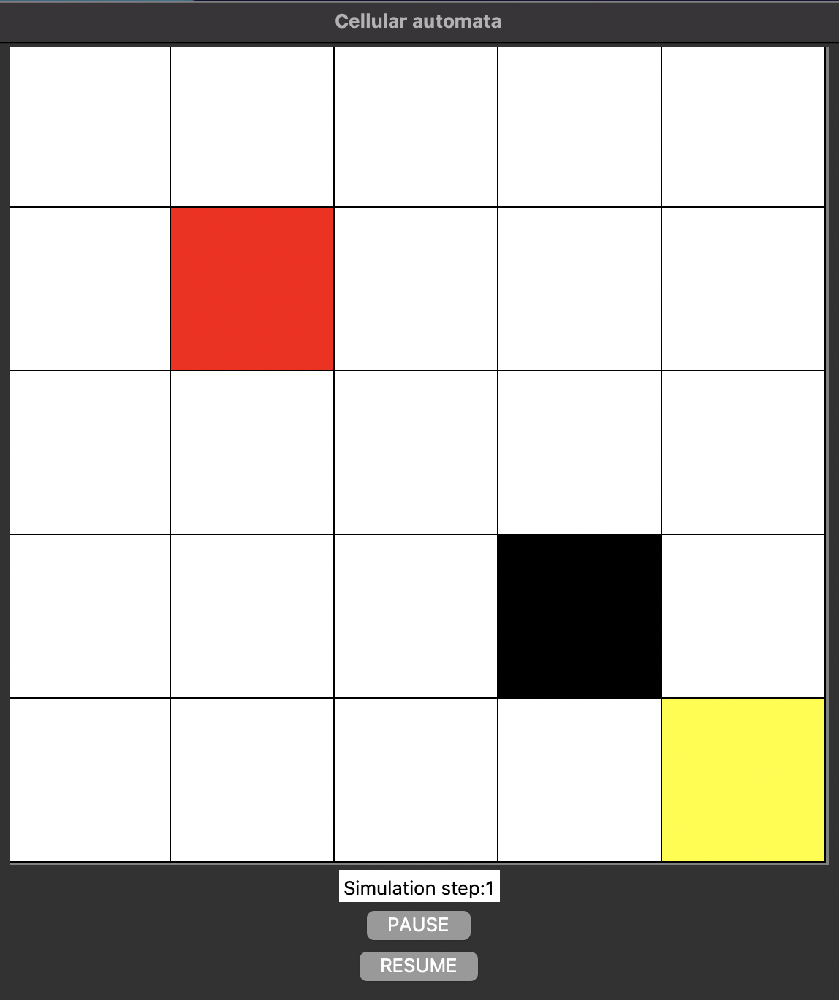
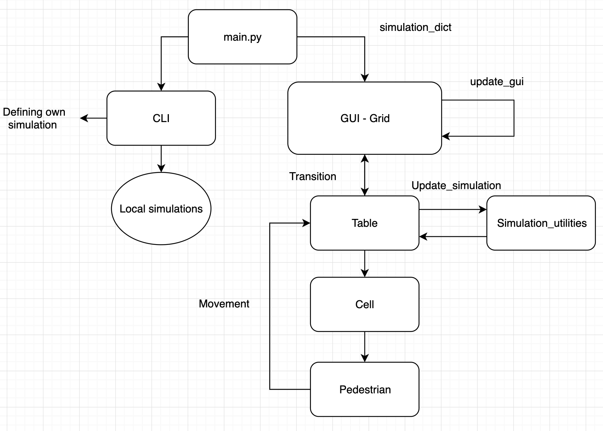

# Exercise 1: Modelling of human crowds 

This repository provides a solution of exercise 1 - a simplified crowd modelling software utilizing the *cellular automaton* model.
*NB!* In order to run the software you must open you repo inside "exercise_1" in order for the python filepaths to be correctly! 

The simulation software is developed using Python and its GUI toolkit [Tkinter](https://docs.python.org/3/library/tkinter.html).

## Features of model: 
- Cellular automaton
- Simulate different speeds on pedestrians
- Dijkstras algorithm

## Dependancies
- numpy
- priorityqueue
- prettytable

## GUI
This is the GUI implemented in order to visualize the simulation. 

## Flow diagram

